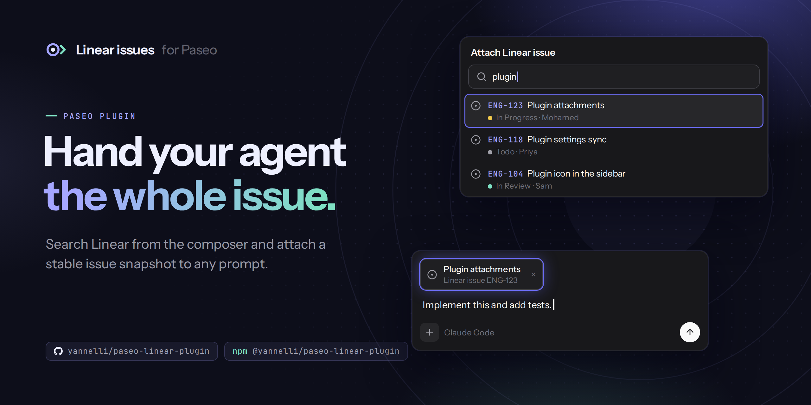
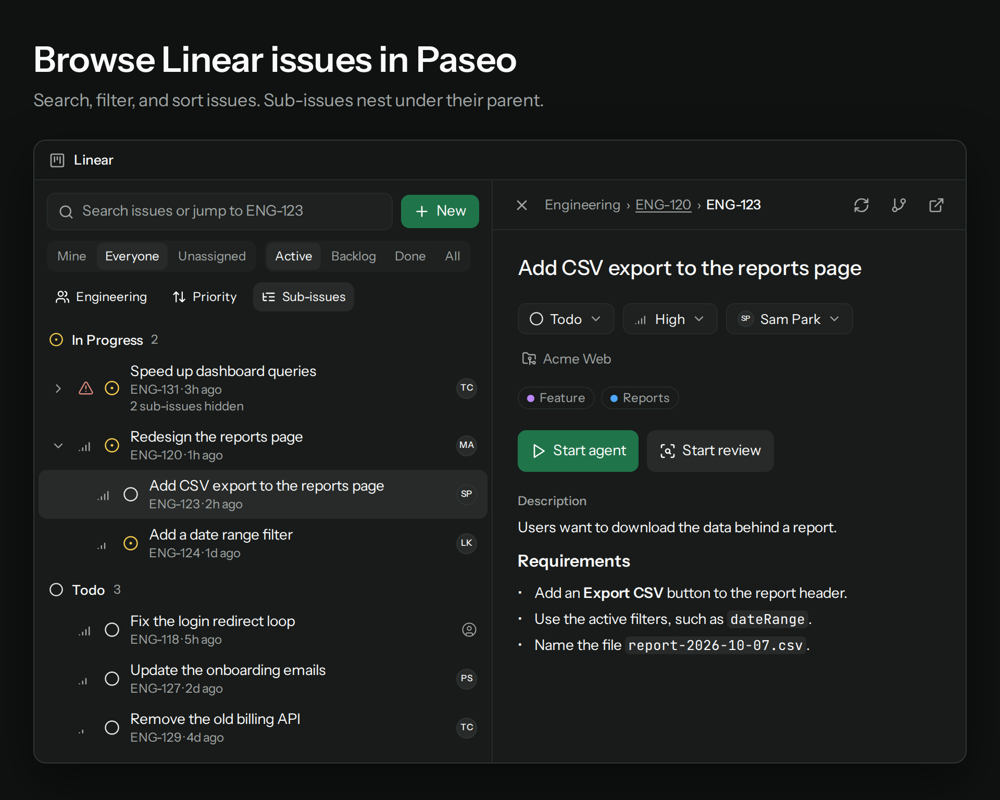
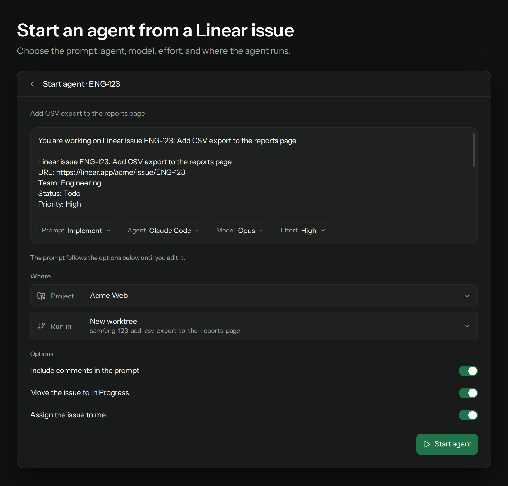
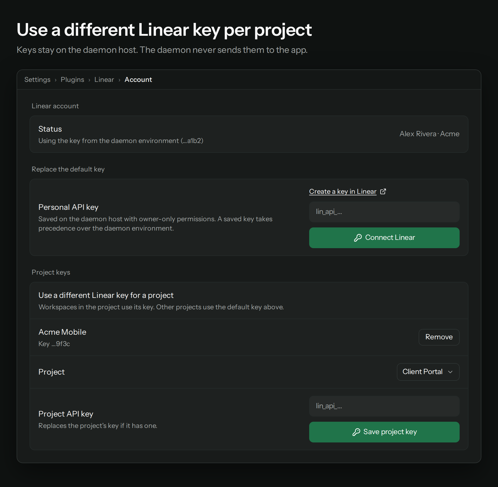

# Linear issues for Paseo

A Paseo plugin for Linear. It adds a Linear screen and a workspace panel where you browse and edit Linear issues. From an issue, you can start an agent that implements it or reviews the work. Your Linear API key stays on the daemon host.

- Browse issues in a list next to the issue view. Search and filter the list, and change its sort order.
- Nest sub-issues under their parent. Breadcrumbs show the parent chain of an issue.
- Read descriptions and comments as Markdown.
- Edit the description in place. It saves as you type. Check off task list items without opening the editor.
- Change the status, priority, and assignee. Add comments and create issues.
- Start an agent or a review from an issue. Choose the prompt, agent, model, effort, project, and where the agent runs.
- Use a different Linear key for a Paseo project.
- See saved results at once while the plugin gets new data from Linear.
- Attach a Linear issue to a message in the composer.
- Follow an agent in **Linear Live**: sub-issues, todos, and a map of the files it reads and edits.
- Open the issue from a **Linear** pill in each agent's composer, or send an issue to any agent.
- Let agent todos move sub-issues to In Progress and Done. This is off until you turn it on.
- Let an agent read a project's guidelines and propose its instructions and steps.
- Turn Linear on or off for all projects, or project by project.







The images are illustrations with sample data. They come from `docs/graphics`; see [Graphics](#graphics).

## What you need

- Paseo 0.10.0 or newer, with **Enable plugins** turned on in **Settings → Plugins**.
- A Linear personal API key. Create one in Linear under **Settings → Security & access → Personal API keys**. To change issues, add comments, or create issues, the key must have write access.

## Install

```sh
paseo plugin add npm:@yannelli/paseo-linear-plugin
paseo plugin ls paseo-linear-plugin
```

Version 0.4.0 and earlier used the id `linear`. To upgrade from those versions, run `paseo plugin remove linear` first, then add the plugin again. Your saved keys stay in place.

To pin a version, add it to the source, for example `npm:@yannelli/paseo-linear-plugin@0.1.0`. To install a Git tag instead, run `paseo plugin add github:yannelli/paseo-linear-plugin --ref v0.1.0`. Plugins run trusted code with the daemon user's access.

## Connect Linear

### Default key

Open **Settings → Plugins → Linear → Account**, paste your key, and select **Connect Linear**. The Linear screen shows the same form until a key is set. The plugin checks the key with Linear before it saves it.

The daemon saves the key in `$PASEO_HOME/plugin-data/linear/credentials.json`, which is `~/.paseo/plugin-data/linear/credentials.json` by default. The file has mode `0600` and its folder has mode `0700`. A saved key takes effect at once. **Disconnect** deletes the saved key.

### Key from the environment

If no key is saved, the plugin uses `LINEAR_API_KEY` from the environment that starts the daemon:

```sh
export LINEAR_API_KEY="lin_api_..."
```

A saved key takes precedence over the environment. To change the environment key, restart the daemon with the new value.

### Project keys

A Paseo project can use a different Linear key, for example for a different Linear workspace. In the **Project keys** section of the Account settings, choose the project, paste the key, and select **Save project key**.

- The Linear panel in a workspace of that project uses the project key.
- When project keys exist, the Linear screen shows a key button in the filter row. Use it to switch between **Default key** and the project keys.
- The plugin looks for a key in this order: the project key, the saved default key, then `LINEAR_API_KEY`.
- The composer attachment always uses the default key.

## Use

### Browse issues

Open **Linear** from the sidebar, or run **Linear: Open issues** in the command center. In a workspace, run **Linear: Show issues in this workspace**, or type `/linear` in the composer. `/linear ENG-123` opens that issue, and `/linear <text>` searches.

- The search box matches issue titles and descriptions. An identifier such as `ENG-123` shows that issue only.
- Filter by assignee (**Mine**, **Everyone**, **Unassigned**), by status (**Active**, **Backlog**, **Done**, **All**), and by team.
- The list groups issues by status and loads more as you scroll.
- If you map Linear teams to a project in **Settings → Plugins → Linear → Projects**, the panel starts with the first mapped team.

### Sort

Select the sort button in the filter row. The options are **Last updated**, **Newest**, **Priority**, **Due date**, and **Title**.

### Sub-issues

Select **Sub-issues** in the filter row to nest sub-issues under their parent. A sub-issue shows under its parent when the parent is in the list, even if their statuses differ. Select the chevron to collapse or expand a parent. A collapsed parent shows how many sub-issues it hides.

The issue header shows breadcrumbs: the team, the parent chain, then the issue, for example **Engineering › ENG-120 › ENG-123**. Select a parent to open it. A long chain folds its middle into **…**; select it to show all parents.

### Read and edit an issue

- Select the status, priority, or assignee chip to change it.
- Descriptions and comments show as Markdown: headings, lists, task lists, code, quotes, tables, and links.
- Select the pencil next to **Description** to edit it as Markdown. The plugin saves about one second after you stop typing, and when you leave the box. The line under the box shows **Saving…**, then **Saved to Linear**. If a save fails, it shows **Could not save** and a **Retry** button. **Done** (or Escape) closes the editor only after Linear accepts the text.
- Select a task list checkbox in the description to check or uncheck it. The plugin changes only that box in the Markdown and saves it to Linear. If the save fails, the issue reloads from Linear.
- Add a comment in the **Activity** section.
- The header buttons refresh the issue, copy its branch name, and open it in Linear.
- Select **New issue**, or run **Linear: Create issue**, to create an issue. Set the team, status, priority, assignee, title, and a Markdown description.

### Start an agent

Select **Start agent** or **Start review** in the issue view. The agent setup page opens in the panel or the screen. It works with or without a current workspace.

1. Edit the prompt in the prompt box if you want. The prompt follows the template and options until you edit it. Select **Reset prompt** to go back to the template.
2. Use the controls under the prompt box, as in the Paseo composer. They set the prompt template (Implement or Review), the model, the thinking level, and the mode. The thinking level shows when the model has levels, and the mode shows when the agent has modes.
   - The model picker lists the providers first. Select a provider to see its models, or search to find models from all providers.
   - Choosing a model from another provider also changes the agent. The thinking level and mode change to the choices you last used with that agent, or to its defaults.
   - The controls start from your last choices: the model, thinking level, and mode of your last launch from the plugin, then the choices Paseo remembers for new agents. A default model in the settings takes priority for the model. On the mobile app, the plugin cannot read Paseo's choices, so it remembers only launches from the current session.
3. Choose the **Project**. The default is the project of the current workspace. Without a workspace, it is the last project you used for the team, then a project mapped to the team.
4. Choose where the agent runs in **Run in**:
   - **New worktree** on the issue branch.
   - **Check out PR #N** for a review, when the issue links a GitHub pull request.
   - **Check out issue branch** for a review. If nobody pushed the branch yet, the plugin starts a new worktree on it.
   - **Existing agent workspace** or **Implementation workspace**, when an agent already works on the issue.
   - **This workspace**, or **Project folder** when you are not in a workspace of that project.

   The worktree and checkout options show only for a Git project. When agents run in worktrees (the default), a review uses the pull request, then the implementation workspace, then the issue branch.
5. Set the options: **Include comments in the prompt**, **Move the issue to In Progress**, and **Assign the issue to me**. The last two show only for Implement, and only when they would change the issue.
6. Set the **Agent guidance** switches. Each one adds instructions to the prompt. The project keeps your choices for its next launch.
   - **Keep Linear updated:** the agent edits the issue description as it works. It checks off each task list item it finishes and updates the plan when it changes. It posts no comments. Todos start with their issue key, so todo sync can move each sub-issue.
   - **Subagents state their issue key:** each subagent's description and prompt start with the key of the issue it works on. The subagent states the key again when its work moves to another issue.
   - **Hand off work to Paseo agents:** the agent starts one Paseo agent for each sub-issue instead of its built-in subagents. Each one runs in the same workspace on the same provider and model, with thinking that fits its task, and checks off its own items. Linear Live shows their work.

   **Keep Linear updated** and **Hand off work to Paseo agents** give the agent the plugin's `linear` MCP server. It has four tools: `read_issue` and `edit_issue` for the issue and its sub-issues, and `start_agent` and `wait_agent` for agents on the sub-issues. Agents that `start_agent` starts get only `read_issue` and `edit_issue`. Paseo allows these tools without a permission prompt.

   For Claude agents, these switches also add Claude Code hooks. With **Subagents state their issue key** on, each subagent gets the issue keys when it starts. With any switch on, the agent gets the issue again after Claude compacts the conversation. The hooks only print that text.
7. Select **Start agent** or **Start review**.

The plugin starts the agent and then updates Linear. If the Linear update fails, the agent keeps running and a message shows the error. The agent's timeline gets a card that links to the issue. The issue view lists the agents started from it under **Agents on this issue**.

Set the default model, where agents run, the default options, and the Implement and Review templates in **Settings → Plugins → Linear → Prompts**. In **Projects**, add instructions and steps for a project, or append to or replace a template for that project.

### Attach an issue to a message

In the composer, open the attachment menu and choose **Attach Linear issue**. Type an identifier such as `ENG-123`, or words from a title. An empty search lists the 20 most recently updated issues. The agent gets the issue text with your message. The plugin takes this snapshot when you select the issue.

### Turn Linear on or off per project

In **Settings → Plugins → Linear → Projects**, **Use Linear in** has an **All projects** switch and one switch per Paseo project. A project switch wins over **All projects**. A project without its own switch follows **All projects**. Save to apply.

In a project where Linear is off:

- The workspace **Linear** panel and **Linear Live** show that Linear is off.
- Agents get no Linear pill.
- The agent setup page does not offer the project.
- Todo sync and the explore agent skip the project's agents.

The **Linear** screen in the sidebar is not tied to a project, so it stays available. To turn off the whole plugin, use **Settings → Plugins**.

### Linear Live

Linear Live is an agent panel. Open it from the Linear pill, or with **Linear: Open Linear Live** in the command center while an agent is open. It works for agents started from an issue, with Claude, Codex, and other providers.

- **Sub-issues:** each sub-issue shows its Linear status and the agent's todo progress. The todos of the current sub-issue show under it. Select a sub-issue to show only its files on the map. Hide the issues column with the button on the **Issue** card to give the map or the graph the full width. The column becomes a strip with the status of each issue. Select an issue there to show only its files.
- **Map:** files are grouped by folder. The map marks the files the agent read, edited, or created, and the file it is on now. Files the agent touched but the map did not predict have a dashed border. A folder the agent listed or searched gets a solid border, and its header shows how many of its files the agent touched. Reads through the shell count too: `cat`, `sed -n`, `head`, `grep`, `rg`, `ls`, `find`, `git show`, and redirects to files.
- **Graph:** the files and the links between them. A line joins two files when one imports the other, a Markdown or style file links to the other, `package.json` names it, or the text of one names the path of the other. This works for TypeScript and JavaScript (with `tsconfig` paths and workspace packages), Python, Go, Rust, Ruby, CSS and Sass, Markdown, HTML, and config files. Files of one folder sit together under the folder name and take the color of their sub-issue. The issue is in the center, with its sub-issues joined to the files the map gives them. The agent hovers over what it works on: the file it reads or edits, or the sub-issue whose todo it just started. When the work moves, it glides along the links to the next node, and the lines at that node take its color. New files join without moving the rest. Agents that this agent started get their own cursor when they work in the same folder or in a worktree of the same project. An agent with no file activity yet hovers over the sub-issue whose key starts its title. Running subagents circle the agent that started them. Select a sub-issue to show only its files. Select any node to see what it is and how many files it links to. Switch between **Map** and **Graph** on the card, or set the default in **Show files as** in the Live settings.
- **Graph view:** the icon buttons at the top right of the graph move the view. **Follow the running agents** zooms to the nodes the running agents work on and the files next to them, and moves with the agents. **Show the whole graph** zooms out. **Zoom out** and **Zoom in** change the zoom in steps. Scroll to zoom at the pointer, drag to move when zoomed in, or pinch on a touch screen. Each of these stops following. The lock button lets the wheel and drags scroll the page instead. Nodes, lines, and labels keep their size when you zoom, and more file names show when there is room. The graph keeps your follow and lock choices.
- **Agents:** the agents that work under this agent. Paseo agents that this agent started show their status, their files, and their own markers on the map when they work in the same folder or in a worktree of the same project. Select one to open it. Subagents that run inside the provider, such as Claude's Agent tool, show their type, description, and status. For Claude, the daemon reads each subagent's transcript, also for subagents that run in the background, so a subagent shows what it does now, gets its own cursor, and adds its files to the map. Other providers do not send subagent file reads, so the map shows only the files named in the subagent's prompt.
- **Activity:** the latest reads, edits, searches, and commands, with line counts and exit codes.

The map comes from one of two sources. Choose it in **Settings → Plugins → Linear → Live**:

- **Ticket text** (the default) finds file and folder paths in the issue title, description, and sub-issue titles. It costs nothing, but it finds only paths the issue names. Linear sends sub-issue titles but not their descriptions.
- **Explore agent** maps the files first when you start an implement agent. It reads the repository and lists the files for each sub-issue. The implement agent starts when the map is ready, or with the ticket-text map if exploring fails. A saved map is used again, so each issue is explored once. The plugin archives the explore agent when it finishes. Choose its model and effort in the Live settings. A faster, cheaper model, such as Haiku, is usually enough. It lists up to 150 files.

The buttons on the map card control the saved map. **Read files and links again** reloads the map, the folder lists, and the links. **Build** or **Rebuild the map with the explore agent** starts an explore run now and replaces the saved map when it finishes. **Clear the saved map** deletes it, so the map uses the ticket text until the next explore run. You cannot clear a map while an explore run makes it.

The daemon starts the waiting agent, so you can close the app while the map is made. If the plugin reloads or the daemon restarts during the run, the plugin finishes it when the explore agent's turn ends. A waiting agent that has not started after one hour is dropped.

Explore and setup agents are told to only read. The plugin starts them in a mode that asks before tool use when the provider has one: **Always Ask** for Claude, never a bypass mode. When such an agent asks for permission, the plugin answers. It allows file reads inside the project folder and these commands: `ls`, `find`, `rg`, `grep`, `cat`, `head`, `tail`, `wc`, `git ls-files`, and `git grep`. It denies other commands, edits, web requests, redirection, and paths outside the folder. The plugin sees only the requests the provider raises: Claude runs some read commands without asking, and Codex has no read-only mode, so it runs in its default mode and its own sandbox decides what needs a request.

For implement agents on an issue with sub-issues, the prompt asks the agent to start each todo with its sub-issue key, such as `ENG-124: add the queue`. That is how todos map to sub-issues.

### Linear pill

Each agent's composer has a **Linear** pill. On an agent started from an issue, the pill shows the issue key. It opens the issue status, each sub-issue with its todo progress, and buttons for Linear Live, the issue, and **Sync now**. On other agents, the pill searches Linear and sends the issue text to the agent as a message.

### Update Linear from agent todos

Turn on **Update Linear from agent todos** in the Live settings. After each turn of an implement agent, the daemon reads the agent's todos:

- A sub-issue with a todo in progress or done moves to the team's first started status, such as In Progress.
- A sub-issue whose todos are all done moves to the team's first completed status, such as Done.
- The parent moves to In Progress when work starts. When every sub-issue is done, it moves to a started status whose name has "review", such as In Review. It never moves to Done by itself.
- Statuses only move forward. Canceled issues and issues outside the parent and its sub-issues never change.

The daemon reads the issue from Linear before each sync, so a status you changed by hand counts. **Sync now** in the pill runs the same check at once.

### Set up project prompts with an agent

In **Settings → Plugins → Linear → Projects**, select **Start** under **Set up with an agent**. An agent reads the project's AGENTS.md, CLAUDE.md, CONTRIBUTING, README, scripts, and CI files. It then proposes project instructions, steps, and text to add to the Implement and Review prompts. Each change shows the current and proposed text. Turn off the ones you do not want, select **Use accepted changes**, and then save. Nothing changes until you save.

## Data and permissions

- **Your key stays on the daemon host.** When you save a key, the app sends it to the daemon once. The daemon never sends a key back to the app. The app gets only the last four characters, to show which key is in use. Only the daemon sends requests to `https://api.linear.app/graphql`.
- **Data sent to Linear:** queries for issues, teams, users, and comments, and the changes you make. When you start an agent with the options on, the plugin moves the issue to In Progress and assigns it to you.
- **Data sent to the agent provider:** the prompt. It holds the template text and an issue snapshot: identifier, title, URL, team, status, priority, assignee, project, labels, parent, description, sub-issues, and links. It holds comments only when **Include comments in the prompt** is on. It also holds the project instructions and steps from the Projects settings. An attached issue sends the identifier, title, URL, status, priority, assignee, project, labels, and description.
- **Linear Live and setup agents:** the explore agent gets the issue snapshot without comments, and both agents read files in the project. Your agent provider gets what they read. The map of an explore run is saved in `live-maps.json` beside the key file, for up to 200 issues. An agent that waits for a map is saved in `pending-launches.json` there until it starts. Linear Live lists files only in the folders it shows, and reads the files on the graph to find their links, inside the agent's own folder. It does not follow links that lead outside that folder. For a Claude agent with subagents, the daemon reads the tool calls in the subagent transcripts that Claude saves for that session. It sends the app only the tool names, file paths, and commands, never file text.
- **Linear tools for agents:** the daemon runs the `linear` MCP server on `127.0.0.1` only, and only after an agent gets it. Each agent gets its own random token, and its tools reach only its issue and that issue's sub-issues. Edits use the Linear key of the project that loaded the issue. Requests from a web page are refused. `agent-tools.json` beside the key file keeps the port and a hash of each token, so agents keep their tools after a restart. The token itself is in the agent's Paseo config.
- **Claude hooks:** when an **Agent guidance** switch is on for a Claude agent, the daemon writes a Claude Code plugin to `claude-hooks/` beside the key file, one folder for each issue and set of hooks. It holds the issue key and title and the sub-issue keys and titles. The agent starts with `--plugin-dir` set to that folder. The hooks print that text and run no other command. The daemon does not write hooks on Windows hosts.
- **Todo sync:** when it is on, the daemon changes issue statuses in Linear with the key of the project that loaded the issue.
- **Cached results:** the daemon keeps up to 300 recent Linear responses in memory for up to 24 hours. It groups them by a hash of the key, so two keys never share results. The app shows saved results at once with **Showing saved results. Updating…** while it gets new data. An edit clears the cached lists and issues for that key. Saving or removing a key clears the whole cache. The cache is not written to disk, and a daemon restart clears it.

Linear errors, such as a rejected key or a rate limit, show in the panel or as a message.

## How it works

| File | Runtime | Role |
| --- | --- | --- |
| `index.client.tsx` | App | Registers the Linear screen, the workspace panel, the Linear Live panel, the Account, Prompts, Live, and Projects settings, the command center items, the `/linear` command, the timeline card, the composer attachment, and the Linear pill |
| `index.server.ts` | Daemon | Registers the settings, the RPC handlers, and the todo sync hook |
| `client/browser.tsx` | App | Screen and panel: picks the key, then shows the list, the issue, or the agent setup page |
| `client/issue-list.tsx`, `client/issue-row.tsx`, `client/issue-tree.ts` | App | Search, filters, sort, rows, status groups, and sub-issue nesting |
| `client/issue-detail.tsx`, `client/issue-sections.tsx`, `client/breadcrumbs.tsx` | App | Issue view: properties, breadcrumbs, sub-issues, links, agents, and comments |
| `client/issue-description.tsx`, `client/autosave.ts` | App | Description editor, task list checkboxes, and debounced saves |
| `client/markdown.tsx` | App | Renders Markdown |
| `client/launch.tsx`, `client/launch-fields.tsx`, `client/launch-guidance.tsx`, `client/launch-choices.ts`, `client/launch-plan.ts`, `client/agent-options.ts` | App | Agent setup page, Run in options, agent guidance, and agent start |
| `client/model-browser.tsx`, `client/provider-icon.tsx` | App | Model picker and provider icons |
| `client/create-issue.tsx`, `client/pickers.tsx` | App | New issue form and option pickers |
| `client/connect.tsx`, `client/settings-*.tsx` | App | Key form and settings screens |
| `client/queries.ts`, `client/store.ts`, `client/key-scope.tsx` | App | Data hooks with saved results, browser state, and the key in use |
| `client/compat.ts` | App | Registers the screen on Paseo 0.10 and on later releases |
| `client/timeline-card.tsx`, `client/ui.tsx`, `client/glyphs.tsx` | App | Timeline card, shared controls, and icons |
| `client/live-panel.tsx`, `client/live-header.tsx`, `client/live-issues.tsx`, `client/live-feed.tsx`, `client/live-timeline.ts` | App | Linear Live panel, header, sub-issues, activity, and the agent timeline feed |
| `client/live-map.tsx`, `client/live-graph.tsx`, `client/graph-labels.ts`, `client/graph-camera.tsx`, `client/live-cursor.tsx`, `client/live-agents.tsx` | App | File map, file graph with its labels and camera, agent cursors, and the agents list |
| `client/tool-buttons.tsx`, `client/web.ts` | App | Icon buttons for the map and graph, and the wheel listener on the web |
| `client/pill.tsx` | App | Linear pill in each agent's composer |
| `client/project-init.tsx` | App | Project setup proposal in the Projects settings |
| `shared/linear.ts` | Both | RPC contracts and issue schemas |
| `shared/issues.ts` | Both | The `issues.search` RPC and the composer attachment source |
| `shared/settings.ts` | Both | Settings schema: templates, agent defaults, and project settings |
| `shared/prompts.ts` | Both | Default templates and the issue snapshot |
| `shared/markdown.ts` | Both | Markdown parser and task list toggle |
| `shared/live.ts`, `shared/activity.ts`, `shared/subagents.ts` | Both | Linear Live contracts, the ticket text map, timeline activity, and subagent runs |
| `shared/shell-lexer.ts`, `shared/shell-activity.ts` | Both | Shell command parsing for reads, edits, and searches |
| `shared/map-model.ts`, `shared/graph-model.ts`, `shared/graph-geometry.ts`, `shared/graph-camera.ts`, `shared/links.ts` | Both | Map folders, the file graph with its layout and paths, label placement, camera math, and the parsers that find links in files |
| `shared/agent-hooks.ts`, `server/agent-hooks.ts` | Both, Daemon | Claude Code hooks for agent guidance, and the plugin folder the daemon writes |
| `shared/agent-tools.ts`, `server/agent-tools.ts`, `server/mcp-http.ts` | Both, Daemon | The `linear` MCP server: its tools, tokens, and HTTP transport |
| `shared/todo-sync.ts`, `shared/project-setup.ts` | Both | Todo keys, status moves, and setup proposals |
| `server/handlers.ts` | Daemon | RPC handlers, key lookup, and cache use |
| `server/credentials.ts` | Daemon | Key file and key order |
| `server/cache.ts` | Daemon | Response cache in memory |
| `server/graphql.ts`, `server/queries.ts` | Daemon | Linear GraphQL client, queries, and changes |
| `server/linear.ts` | Daemon | Search and snapshot text for the composer attachment |
| `server/live.ts`, `server/links.ts`, `server/subagent-logs.ts`, `server/agent-runs.ts` | Daemon | File listing, links between files, subagent transcripts, explore runs, and the saved maps |
| `server/sync.ts`, `server/init.ts` | Daemon | Todo sync after each turn, and project setup runs |

The client bundle holds no credentials and makes no calls to Linear.

## Development

Use Node.js 24.

```sh
git clone https://github.com/yannelli/paseo-linear-plugin.git
cd paseo-linear-plugin
npm ci
npm run check
paseo plugin add "$PWD"
```

After you edit the source, run `paseo plugin reload paseo-linear-plugin`. `npm run check` runs the typecheck and the tests. The tests cover the Linear client, the key file, the cache, the handlers, sub-issue nesting, the Markdown parser and task list toggle, the description autosave, the agent options, the prompt guidance and its hooks, the MCP server and its tools, the links between files in many languages, the graph layout and camera, and the release scripts. They use a local GraphQL server and do not call Linear.

## Graphics

`docs/graphics/scene.html` and `scene.css` define the README images, the GitHub social preview, and the icon. Render them into `docs/images` with Playwright and Chromium:

```sh
node docs/graphics/render.mjs
```

The script finds Playwright locally or in the global npm root. Set `PLAYWRIGHT_MODULE` to its entry file to choose another copy. It stops if the fonts do not load, if content leaves the frame or is cut off, or if an image is 900 KB or larger. The fonts are Instrument Sans and JetBrains Mono under the [SIL Open Font License](docs/graphics/fonts/OFL.txt). The line icons follow [Lucide](https://lucide.dev), which uses the ISC License. The mark is original and is not the Linear logo.

## Releases

GitHub Actions runs the checks and publishes a release on qualifying pushes to `main`. The first release is `v0.1.0`. The workflow updates `package.json` and `package-lock.json`, pushes an annotated tag, and publishes release notes. It then publishes [`@yannelli/paseo-linear-plugin`](https://www.npmjs.com/package/@yannelli/paseo-linear-plugin) to npm through trusted publishing (OIDC), with no npm token. See [npm publishing](docs/npm-publishing.md) for the first-publish steps.

Use Conventional Commits in commits and squash-merge titles:

| Commit | Version change |
| --- | --- |
| `fix:`, `perf:`, `revert:` | Patch |
| `feat:` | Minor |
| `!` after the type or scope, or a `BREAKING CHANGE:` footer | Major, including before 1.0 |
| `docs:`, `chore:`, `ci:`, and other types without a breaking marker | No release |

The highest change since the last release sets the next version. For example, `fix: trim identifier queries` changes `0.1.0` to `0.1.1`, and `feat: filter by project` changes it to `0.2.0`.

Run `npm run release:dry-run` from a clean `main` checkout with all tags fetched to preview the next release. To complete a GitHub or npm publication that stopped after its tag was pushed, run the **Release** workflow again.

## Contributing

See [CONTRIBUTING.md](CONTRIBUTING.md) for setup, checks, commit message rules, and how releases work.

## License

Apache License 2.0. The plugin started as the Linear example plugin (`plugin-examples/linear`) in [getpaseo/paseo](https://github.com/getpaseo/paseo). See [NOTICE](NOTICE).
