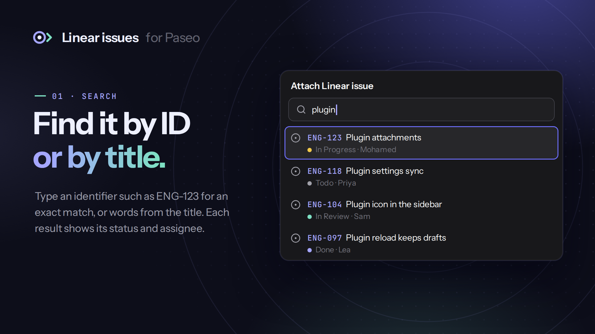
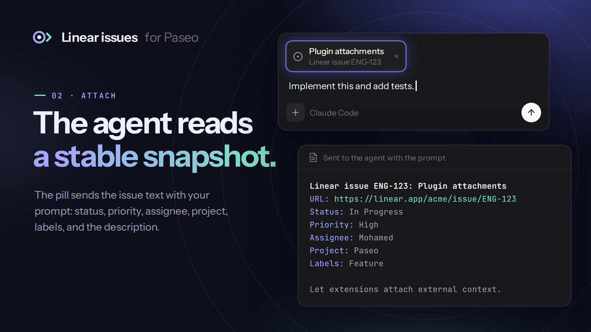
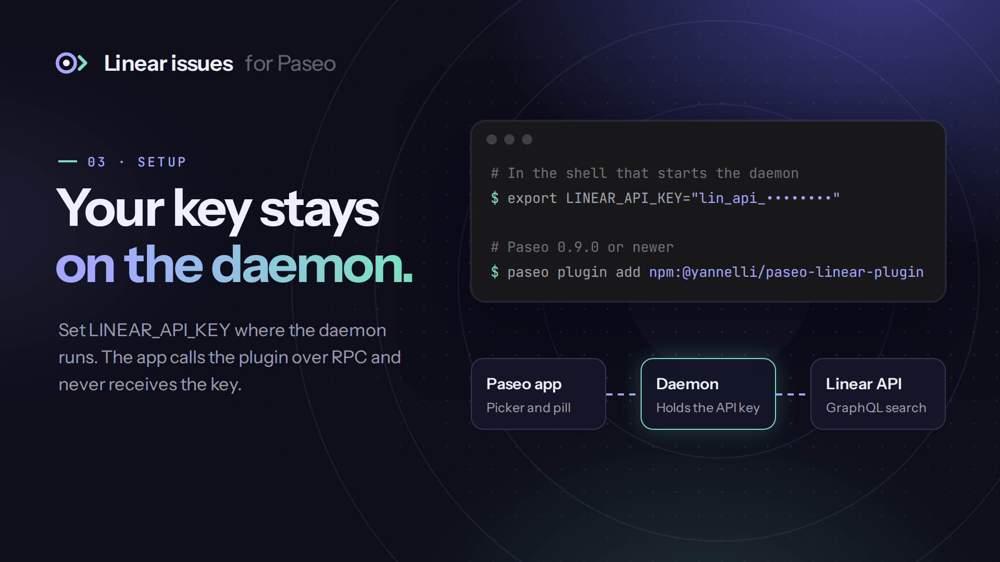

# Linear issues for Paseo

A Paseo plugin that adds **Attach Linear issue** to the message composer. Search by issue identifier or title, then send a snapshot of the issue to the agent with your prompt. The snapshot holds the title, URL, status, priority, assignee, project, labels, and description.







The images are illustrations with sample data. They come from `docs/graphics`; see [Graphics](#graphics).

## What you need

- Paseo 0.9.0 or newer, with **Enable plugins** turned on in **Settings → Plugins**.
- A Linear personal API key in the daemon environment. Create one in Linear under **Settings → Security & access → Personal API keys**. The plugin only reads issues, so a key with read permission is enough.

## Setup

Set the key in the environment that starts the Paseo daemon:

```sh
export LINEAR_API_KEY="lin_api_..."
```

Start or restart the daemon from that environment. The key stays on the daemon host. The app calls the plugin over RPC, and only the daemon subprocess sends requests to `api.linear.app`. To change the key, restart the daemon with the new value. Installing or reloading the plugin does not read a new environment.

## Install

```sh
paseo plugin add npm:@yannelli/paseo-linear-plugin
paseo plugin ls linear
```

To pin a version, add it to the source, for example `npm:@yannelli/paseo-linear-plugin@0.1.0`. To install a Git tag instead, run `paseo plugin add github:yannelli/paseo-linear-plugin --ref v0.1.0`. Plugins run trusted code with the daemon user's access.

## Use

1. Open the attachment menu in the composer and choose **Attach Linear issue**.
2. Type an identifier, such as `ENG-123`, for an exact match. Type other text to search issue titles. An empty search lists the 20 most recently updated issues.
3. Select an issue. A pill with the issue title appears in the composer.
4. Send the message. The agent receives the issue text with your prompt.

The snapshot is taken when you select the issue. Later changes in Linear do not update an attached pill.

## How it works

| File | Runtime | Role |
| --- | --- | --- |
| `shared/issues.ts` | Both | The `issues.search` RPC contract and the attachment source definition |
| `server/linear.ts` | Daemon | Linear GraphQL client, response validation, and snapshot text |
| `server/issues.ts` | Daemon | RPC handler that reads `LINEAR_API_KEY` |
| `index.server.ts` | Daemon | Registers the RPC handler |
| `index.client.ts` | App | Registers the attachment source |

The client bundle holds no credentials and makes no calls to Linear.

## Development

Use Node.js 24.

```sh
git clone https://github.com/yannelli/paseo-linear-plugin.git
cd paseo-linear-plugin
npm ci
npm run check
paseo plugin add "$PWD"
```

After you edit the source, run `paseo plugin reload linear`. `npm run check` runs the typecheck, the Linear client tests against a local GraphQL server, and the release script tests.

## Graphics

`docs/graphics/scene.html` and `scene.css` define the README images, the GitHub social preview, and the icon. Render them into `docs/images` with Playwright and Chromium:

```sh
node docs/graphics/render.mjs
```

The script finds Playwright locally or in the global npm root. Set `PLAYWRIGHT_MODULE` to its entry file to choose another copy. The fonts are Instrument Sans and JetBrains Mono under the [SIL Open Font License](docs/graphics/fonts/OFL.txt). The mark is original and is not the Linear logo.

## Releases

GitHub Actions runs the checks and publishes a release on qualifying pushes to `main`. The first release is `v0.1.0`. The workflow updates `package.json` and `package-lock.json`, pushes an annotated tag, and publishes release notes. It then publishes [`@yannelli/paseo-linear-plugin`](https://www.npmjs.com/package/@yannelli/paseo-linear-plugin) to npm through trusted publishing (OIDC), with no npm token. See [npm publishing](docs/npm-publishing.md) for the first-publish steps.

Use Conventional Commits in commits and squash-merge titles:

| Commit | Version change |
| --- | --- |
| `fix:`, `perf:`, `revert:` | Patch |
| `feat:` | Minor |
| `!` after the type or scope, or a `BREAKING CHANGE:` footer | Major, including before 1.0 |
| `docs:`, `chore:`, `ci:`, and other types without a breaking marker | No release |

The highest change since the last release sets the next version. For example, `fix: trim identifier queries` changes `0.1.0` to `0.1.1`, and `feat: filter by project` changes it to `0.2.0`.

Run `npm run release:dry-run` from a clean `main` checkout with all tags fetched to preview the next release. To complete a GitHub or npm publication that stopped after its tag was pushed, run the **Release** workflow again.

## License

Apache License 2.0. The plugin source comes from the Linear example in [getpaseo/paseo](https://github.com/getpaseo/paseo/tree/main/plugin-examples/linear). See [NOTICE](NOTICE).
